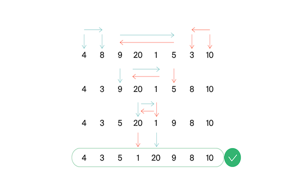

**B. Эффективная быстрая сортировка**  
Ограничение времени	0.5 секунд  
Ограничение памяти	17Mb  
Ввод стандартный ввод или input.txt  
Вывод стандартный вывод или output.txt  

Тимофей решил организовать соревнование по спортивному программированию, чтобы найти талантливых стажёров. Задачи подобраны, участники зарегистрированы, тесты написаны. Осталось придумать, как в конце соревнования будет определяться победитель.  

Каждый участник имеет уникальный логин. Когда соревнование закончится, к нему будут привязаны два показателя: количество решённых задач Pi и размер штрафа Fi. Штраф начисляется за неудачные попытки и время, затраченное на задачу.  

Тимофей решил сортировать таблицу результатов следующим образом: при сравнении двух участников выше будет идти тот, у которого решено больше задач. При равенстве числа решённых задач первым идёт участник с меньшим штрафом. Если же и штрафы совпадают, то первым будет тот, у которого логин идёт раньше в алфавитном (лексикографическом) порядке.  

Тимофей заказал толстовки для победителей и накануне поехал за ними в магазин. В своё отсутствие он поручил вам реализовать алгоритм быстрой сортировки (англ. quick sort) для таблицы результатов. Так как Тимофей любит спортивное программирование и не любит зря расходовать оперативную память, то ваша реализация сортировки не может потреблять O(n) дополнительной памяти для промежуточных данных (такая модификация быстрой сортировки называется "in-place").  

Как работает in-place quick sort  
Как и в случае обычной быстрой сортировки, которая использует дополнительную память, необходимо выбрать опорный элемент (англ. pivot), а затем переупорядочить массив. Сделаем так, чтобы сначала шли элементы, не превосходящие опорного, а затем —– большие опорного.  

Затем сортировка вызывается рекурсивно для двух полученных частей. Именно на этапе разделения элементов на группы в обычном алгоритме используется дополнительная память. Теперь разберёмся, как реализовать этот шаг in-place.  

Пусть мы как-то выбрали опорный элемент. Заведём два указателя left и right, которые изначально будут указывать на левый и правый концы отрезка соответственно. Затем будем двигать левый указатель вправо до тех пор, пока он указывает на элемент, меньший опорного. Аналогично двигаем правый указатель влево, пока он стоит на элементе, превосходящем опорный. В итоге окажется, что что левее от left все элементы точно принадлежат первой группе, а правее от right — второй. Элементы, на которых стоят указатели, нарушают порядок. Поменяем их местами (в большинстве языков программирования используется функция swap()) и продвинем указатели на следующие элементы. Будем повторять это действие до тех пор, пока left и right не столкнутся.  
На рисунке представлен пример разделения при pivot=5. Указатель left — голубой, right — оранжевый.  

  

Формат ввода  
В первой строке задано число участников n, 1 ≤ n ≤ 100 000.  
В каждой из следующих n строк задана информация про одного из участников.
i-й участник описывается тремя параметрами:  

уникальным логином (строкой из маленьких латинских букв длиной не более 20)  
числом решённых задач Pi  
штрафом Fi  
Fi и Pi — целые числа, лежащие в диапазоне от 0 до 109.  
Формат вывода  
Для отсортированного списка участников выведите по порядку их логины по одному в строке.  