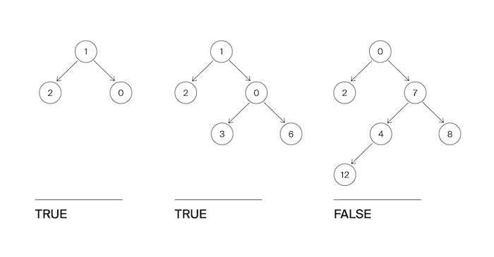

**B. Сбалансированное дерево**

Ограничение времени	1 секунда  
Ограничение памяти	64Mb  
Ввод	стандартный ввод или input.txt  
Вывод	стандартный вывод или output.txt  

Гоше очень понравилось слушать рассказ Тимофея про деревья. Особенно часть про сбалансированные деревья. Он решил написать функцию, которая определяет, сбалансировано ли дерево.  
Дерево считается сбалансированным, если левое и правое поддеревья каждой вершины отличаются по высоте не больше, чем на единицу.  

  

Формат ввода  
На вход функции подаётся корень бинарного дерева.  

Формат вывода  
Функция должна вернуть True, если дерево сбалансировано в соответствии с критерием из условия, иначе - False.  